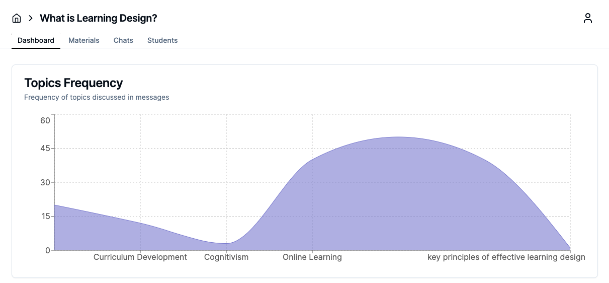
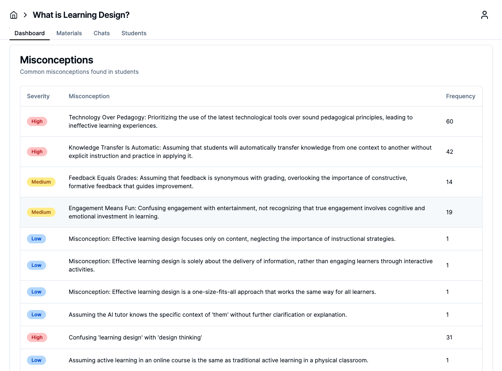
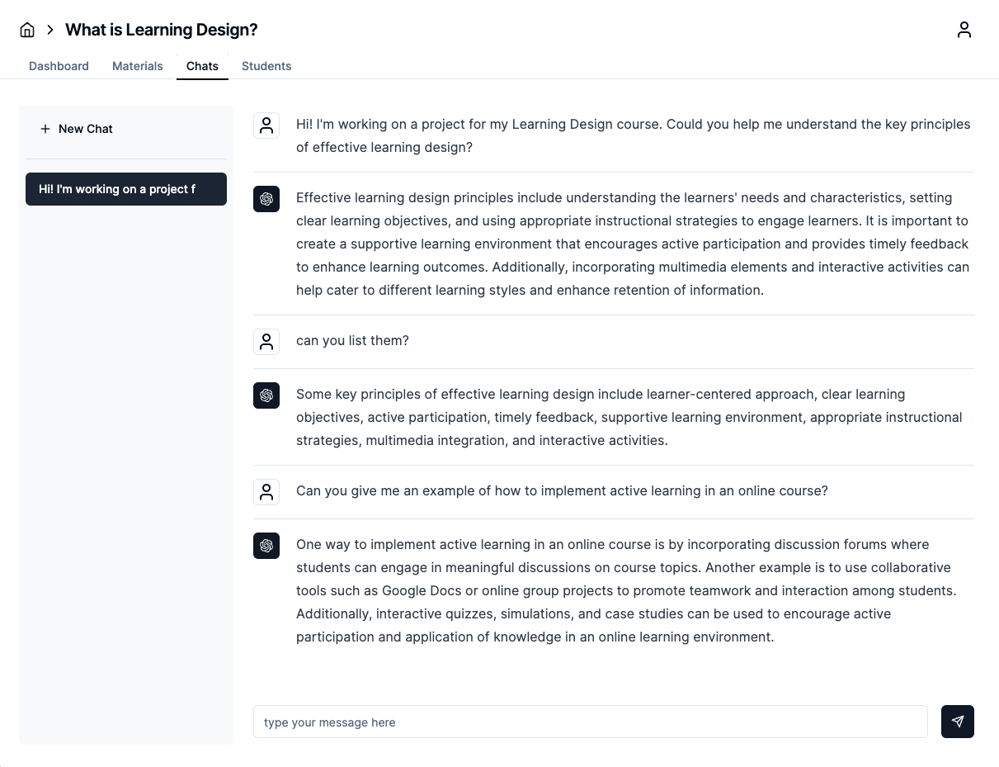
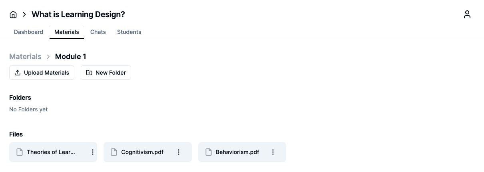
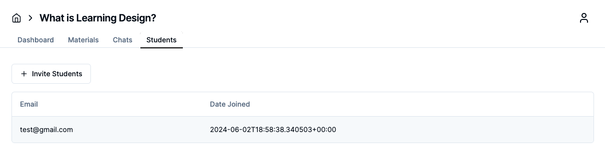
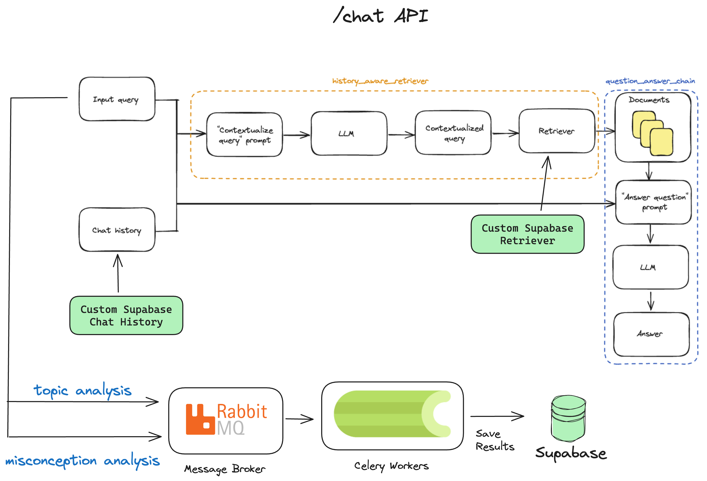

# Lanvas

An open-source self-hostable platform for institutes to instantly create chatbots for their courses that use the course material as their knowledge base. Here is the [backend](https://github.com/13point5/lanvas-backend) for the platform with the architecture explained.

Additionally the platform provides faculty aggregated and anonymous analytics on student interactions with the platform as shown below.

## Features

1. Topic Frequency chart
   

2. Misconceptions and Severity
   

3. Chatbot for the course
   

4. Intuitive CMS
   

5. Student Management System
   

## Main Backend Architecture

The diagram below shows the architecture for the main chat and analytics parts of the platform. For more information please visit the [backend repo](https://github.com/13point5/lanvas-backend).

